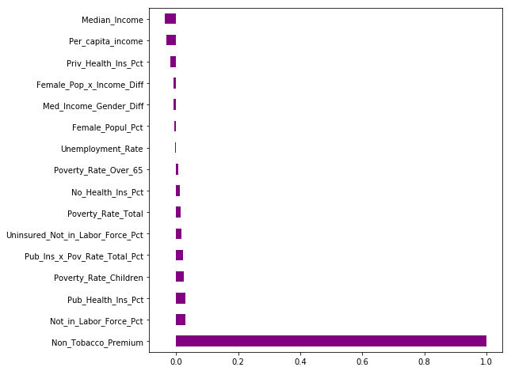

## Project 2 Blog

It’s now the end of week three of 12 in the data science bootcamp and our first solo data science project is in the books. If not for all the long days and amount of open jupyter notebook tabs I have from the past few weeks, it would hard to believe that we have learned and accomplished so much in such a short amount of time.

Just a couple weeks ago, I understood nothing about HTML or how it can be used to create web pages and scrape online data. Now I have built my own webpage and successfully used both Pandas and BeautifulSoup to gather online data to use for data analysis.

At the start of the bootcamp, I feel like I needed to reference documentation to do just about anything in Pandas, and now it almost feels second nature. Just days ago, the main thing linear regression brought to mind was sitting in undergrad stats class and wondering, but not understanding how I could use these models to become a wildly successful gambler who could avoid ever getting a real job.

Now, I have completed a full linear regression modeling project that yielded some interesting results on an important topic, and presented to a room full of people about it. Plus the linear regression now makes so much more sense than it did while learning it in a classroom without applying it to a real-world problem.

#### Project 2 Details

For my first solo project, I wanted to look at what can help us predict prices of the ever-growing health insurance premiums that most Americans pay each month. For this, I gathered data from the state of Iowa about all of the ACA-compliant healthcare plans that are available in each county of the state. I combined that data set with county-level economic data from the U.S. census to see how economic variables of a county relate to healthcare premium prices.

The Pandas skills sharpened in recent weeks came in very handy for this, as the census data was some of the messiest and difficult to understand of any data set I have encountered so far. But after getting rid of columns that had too many blank or nonsensical values, editing column names that were the length of multiple run-on sentences while figuring out what they actually mean, and struggling with how to merge my data sets, I was ready to run linear regression models.

Working with this data gave me good experience working with a lot of the common issues that data scientists encounter when building linear regression models. I had to figure out if it made sense to work with log-transformed price data, as is common when running models on price data.  At first, I was struggling to figure out why my model was giving a perfect $r^{2}$ score of 1 for my model, and realized some variables were multicollinear with my target variable of healthcare premium price. Even after removing those variables, I saw that age was crowding out the effect of other variables in my regression models. Once I ran a model with age as my only predictive variable and saw that model produce an r^2 just slightly smaller than any model that included age along with any combination of other variables, I decided to drop that as a predictor and see what else could help predict insurance premiums.

With the census data I narrowed down a collection of over 500 features to about 20 I thought would be most predictive. In addition, I engineered some features from those that I thought could be even more predictive. This made me confident that my census economic data would show some strong relationships with premiums, and help improve the prediction power of my mode.

However, that was not at all the case. Of the 20+ economic variables I modeled with, none had a correlation with premium price above .04. After all of the data I analyzed and modeled with on this project, it turned out that age on its own predicted healthcare premiums about as well as any other model.

 One of the biggest lessons of this project was that the answer to questions like what predicts healthcare prices can be a lot simpler than we expect. I thought that healthcare premiums would be influenced by a wide range of factors that might also have complex interactions between them. But from the data I looked at, age had a very strong relationship with premium prices, while every other variable had little to no relationship with premiums. As data scientists, we will often have a desire to come up with clever and complicated answers to problems, when a much simpler solution might be more effective, and easy to interpret or implement.

With all of the features that I could include in my models, the most predictive combination of features that did not include age produced an $r^{2}$ score of .17, while $r^{2}$ was .81 with age on its own. It does seem that there is other data out there which would help build a more predictive model, as age and the data I analyzed do not capture all the variability in healthcare premiums.

Once the modeling was done, it was time to present. While I have given many presentations before, I forgot how nerve-wracking it can be to speak to a room full of people when it’s been months since you’ve done it. Fortunately, I think I was able to hide the nerves and give a clear and confidently delivered presentation.

#### Going Forward

As I finish my second bootcamp project, I once again find myself looking back and feeling good about at all the skills I have improved upon since starting. It makes the long days seem well worth it. In less than the past two weeks, I have learned how to build a webpage, scraped online data for a project, run regressions with Statsmodels and SKLearn, learned how/when to drop or transform variables in a regression model, tuned regression models to optimize them, and found solutions to some programming problems that seemed well beyond my skill set not long ago.

In knowing that we are only 25% of the way through the bootcamp and have already come such a long way, I continue to gain confidence that being an effective, professional data scientist is in my near future. I am excited to rest up this weekend, and to learn more new tools and work on an exciting new project next week.
